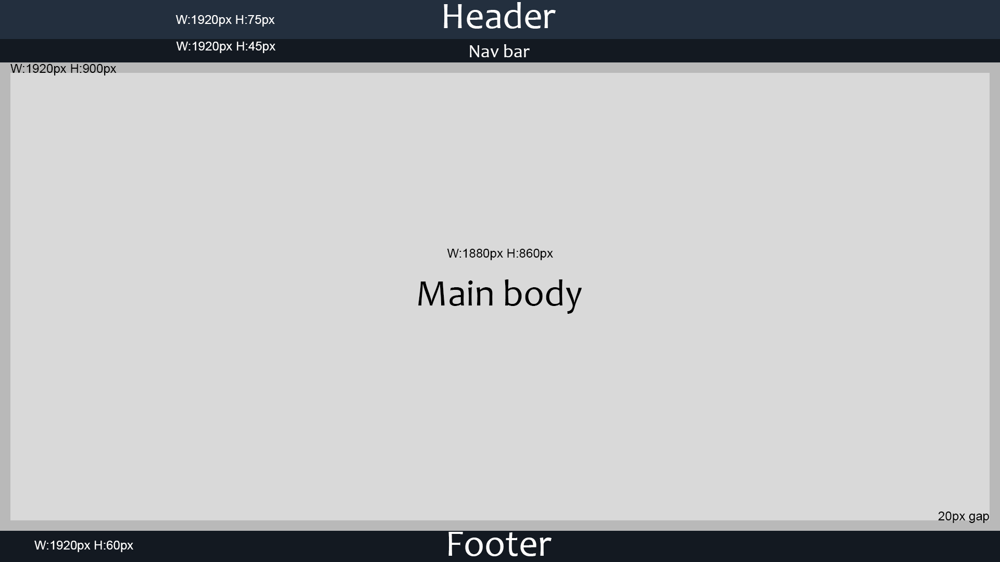
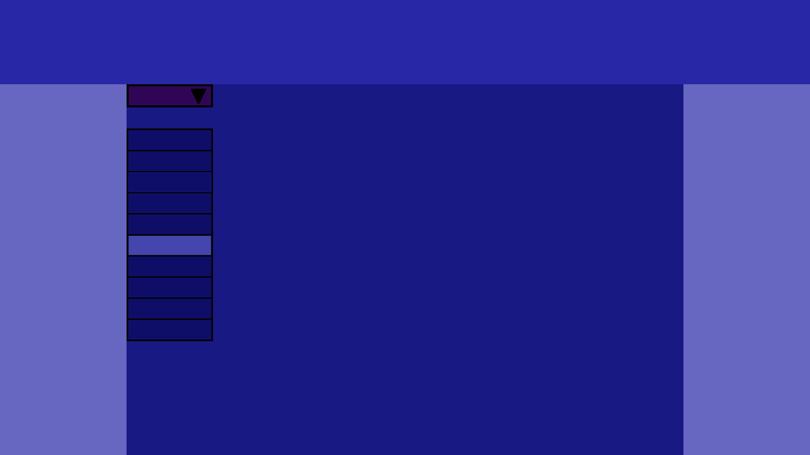
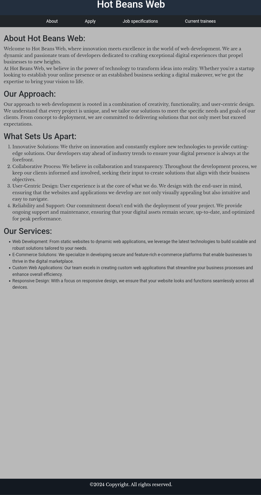
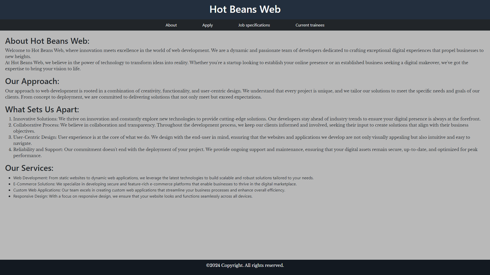
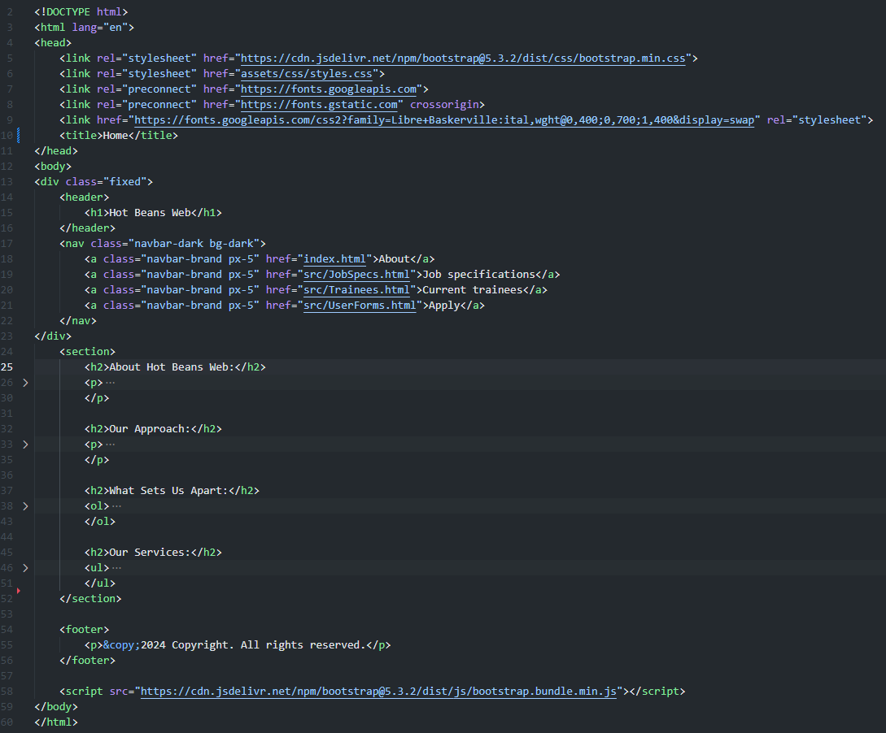

# unit 15 assignment 2
https://github.com/431115/U15A2.git
https://431115.github.io/U15A2/index.html

## Requirements 

### User requirements

1. Accessible to all users
2. A website that is easy to navigate
3. A website that is visually appealing
4. A website that is informative
5. A website that is interactive
6. A website that is easy to use

### Client requirements
1. A profile of the company itself
2. Profiles of existing trainee web developers
3. Job specifications and required qualifications
4. An on-line application form
5. Links to web development courses

### Target audience
The target audience for the site is people who have completed training courses or qualifications related to web development and are now looking for a job as a web developer. 

## File structure

## To do list
- Create User Requirements **12/02/2024**
- Create storyboards **13/02/2024**
- Create website **14/02/2024**
- Testing **15/02/2024**
- Get feedback and Respond to feedback **16/02/24**
- Optimisations using the feedback **19/02/2024**
- rest of the documentation **22/02/2024**
- Double Check **27/02/2024**

## Design

### Storyboard 1

### Storyboard 2

### Design decision.
I have chosen the first design because it suits the user requirements and the client requirements better then the second design. The first design is more visually appealing and interactive. It is also easier to navigate and use. The color scheme for the Second design is not great and to complicated and can be hard on the eyes so it does not suit the user requirements. The first design has more place for the content to go. Another reason I chose the first design is because it does not have to be complicated as the user will be the people who are applying for the job.

### Color scheme

The reason why I chose this color scheme is because it is very simple. A simple color reduces the visual clutter and makes it easier for the users to focus on the content. Users can navigate more effectively when presented with a clean and straightforward color scheme. Having to many colors also makes the website look unprofessional and chaotic. Having a simple color scheme also makes the text stand out more helping with visually impaired users.

### Typography
The font I have chose is "Libre Baskerville" its a serif font. I chose this font because it is easy to read and looks professional while still being simple. The font is also easy to read for visually impaired users. The font is also easy to read on all devices. I have also put "serif" as the fallback font in case people cant load the "Libre Baskerville" font.

## Navigation map
|           | JobSpecs | Trainees | UserForms | index   |
| --------- | -------- | -------- | --------- | ------- |
| JobSpecs  |     ✓    |     ✓    |     ✓     |     ✓   |
| Trainees  |     ✓    |     ✓    |     ✓     |     ✓   |
| UserForms |     ✓    |     ✓    |     ✓     |     ✓   |
| index     |     ✓    |     ✓    |     ✓     |     ✓   |

## Issues
I only have two issues happen while making the website. The first issue was that the navigation button didn't work. The second issue was that ... .Both of these issues were fixed and logged in github under the issues tab.

## Testing

### Test plan
1. Test the website on different web browsers
    * expected result: the website should look the same on all web browsers
2. Test the website on different devices
    * expected result: the website should look the same on all devices
3. Test the website's loading speed 
    * expected result: the website should load in under or around 3 seconds
4. Test the website's navigation
    * expected result: the website's navigation should work according to the navigation map
5. Test the forms to make sure people cant submit with out filling in all the fields
    * expected result: the form should fail to submit if all the fields are not filled in

### Test results

#### **TEST 1**
The website as expected looks the same on all web browsers I testing it on the web browsers I tested it on were:
- Opera GX

- Microsoft Edge

- Google Chrome

#### **TEST 2**
The website as expected looks the same on all devices I tested it on the devices I tested it on were:
- Phone

- Desktop

#### **TEST 3**
The website loaded in 118ms which is really good and is under the expected time of 3 seconds I used [pingdom](https://tools.pingdom.com/) to test the loading speed. the full report is:

#### **TEST 4**

I tested the website's navigation according to the navigation map and it worked as expected.

- expected result

|           | JobSpecs | Trainees | UserForms | index   |
| --------- | -------- | -------- | --------- | ------- |
| JobSpecs  |     ✓    |     ✓    |     ✓     |     ✓   |
| Trainees  |     ✓    |     ✓    |     ✓     |     ✓   |
| UserForms |     ✓    |     ✓    |     ✓     |     ✓   |
| index     |     ✓    |     ✓    |     ✓     |     ✓   |

- actual result

|           | JobSpecs | Trainees | UserForms | index   |
| --------- | -------- | -------- | --------- | ------- |
| JobSpecs  |     ✓    |     ✓    |     ✓     |     ✓   |
| Trainees  |     ✓    |     ✓    |     ✓     |     ✓   |
| UserForms |     ✓    |     ✓    |     ✓     |     ✓   |
| index     |     ✓    |     ✓    |     ✓     |     ✓   |

#### **TEST 5**
The form failed to submit if all the fields were not filled or if the email was not in the correct format as expected.

## Feedback

### Adam
The website looks nice and simple. The navigation is easy to use which makes it easy to navigate the only problem is that the apply button is second and it would benefit from being the last button instead. The forms page could use with more forms like a place to add your phone number and references. The current trainees page is unorganized and could use with something like a carousel to make it look better and easier to use.

### Aiden
The color scheme for the website looks very dull and boring. The job specifications page does not have some of the necessary information like the salary, location, ect. The website looks to simple and could use with more things to make it look more visually appealing. Another thing is that the current trainees page has a massive unnecessary gap. 

### Responding to feedback
I have taken the feedback into account and my response to the feedback is. I will move the apply button to be the last one as it makes more sense to apply after you have read about the job. I will also update the forms page to include phone numbers but not the references as it is not necessary for this job. For the current trainees page i have decided to add a carousel in the next version of the website as it would make that page more visually appealing and compact. For the color scheme I have decided to keep it as it is because I don't want to over complicate the website and make it look unprofessional and also having a simple color scheme makes the text stand out more helping with visually impaired users. In the next update of the website I will also add more information to the job specifications page to make it more informative so it better suits the user requirements. As for the on the current trainees page that will be removed when I implement the carousel.

## Optimisations
I have make some changed to the website from when it was first looked at.

Using the feedback I have make the following changes to the website:
- I have moved the apply button to be the last button on the navigation bar
- I have updated the forms page to include phone numbers.

#### **Old navigation**

#### **New navigation**

#### **Old form**

#### **New form**

#### **Old looks of the website**

This is the before the website was finished. The website looks very simple and easy to navigate. The color scheme is very simple and easy on the eyes. The website is also very informative and interactive. The website is also very easy to use. Something were off like the navigation buttons were far apart and there was no way to get back the index page from the other pages.

#### **Final looks of the website**

This is the final look of the website. I added the information and changed the navigation buttons to be closer together. I also added another button to the navigation bar to allow the user to get back to the index page from the other pages. 

## Evaluation

### Design
I think the design of the website meets the user requirements and the client requirements and meets the stated purpose of the website. 

#### **Color scheme**
One of the ways my design meets the user and clint requirements is because the color scheme is very simple which reduces the visual clutter and makes it easier for the users to focus on the content. Another way the color scheme meets the user and client requirements is because it makes the text stand out more helping with visually impaired users. The color scheme also makes the website look more professional and easy to navigate.

#### **Typography**
I feel like the font I have chosen fits best with the user and client requirements because it is a very commonly used font which means that most browsers will be able to load it and if it cant load it will use the fallback font. The font is made to look professional and still making it easy to read. 

#### **Layout**
I feel like the layout of the website in its final form meets the user and client requirements because as shown in the navigation map the website is easy to navigate and use. The website is also visually appealing and informative because of the layout I have chosen to use. Also having that layout makes the information easy to find and makes it stand out more.

#### **Conclusion**
In conclusion I feel think the design of the website meets the user and client requirements, The website also fits the target audience because of the decisions I have made in the design of the website. The website is also easy to navigate and use because of the design decisions I have made. The website is also visually appealing and informative because of the design decisions I have made.

### Development
While I was coding the website I tried to make the code as clean and clear as possible. I used correct spacing and I named the classes appropriately. I did this so other people can change the code with out having to spend a lot of time trying to figure out what everything does. The only thing that I could have done better is to add comments to the code to make it even easier for other people to understand the code and or me if I have to come back to the code in the future. I also tried to make the code easier to maintain and optimise if need be.

While I was developing the website I used visual studio code which allowed me to use github to save my work as I was doing it, allowing me to go back to previous version in case I had to which helped me improve my productivity. Another thing that helped me is that github has issue log which allowed me to keep track of any issues that accrued while I was coding the website. github also allowed me to publish the website so I could test it on different devices and web browsers more effectively. Compared to other tools I could have used I think that visual studio code with github was the best tool for the job because it allowed me to do everything I needed to do in one place effectively.

### Optimization
For my optimization I waited in till I was done with the website where I then I asked my pairs to give me feedback on my website which provided me some key points I needed changing and adding. I responded to the feedback saying which things I will change now and in the next version and what things I wont change and stating why. I have also made changes my self to the website while I was adding information and I ended up finding 2 issues which where fixed and logged.

I have also made a test plan which I followed to test the website on various things to insure that the website meets the user and client requirements. This also allowed me to check for any issues on the website and fix them, which helped me optimize the website. In the future I will also add more things to the test plan to make sure everything on the website works as its meant to without any issues.